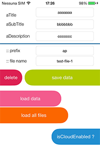
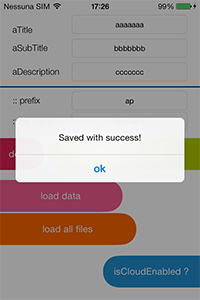
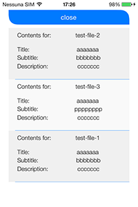

iCloud-Helper
=============

Simple **iCloud file managment**.  
Read, write, load, list files across devices, easily.

Before starting, please read **Apple official reference**:
<https://developer.apple.com/icloud/documentation/>


##Requirements

- A valid Provisioning Profile ( with iCloud access )
- An iCloud account
- iOS 5.1+
- ARC / Non ARC
- iOS device
- Security.framework

---

##Configuration

Copy these files to your project:

	APCloudCore.h
	APCloudCore.m
	APCloudDocument.h
	APCloudDocument.m
	APCloudFileSystem.h
	APCloudFileSystem.m
	APCloudData.h
	APCloudData.m
	NSString+MD5.h
	NSString+MD5.m
	
and import `Security.framework` to your project.

---

###Screenshots



  



##How to use

Import `#import "APCloudCore.h"` in your project.

Next, set your `delegate`, and your `file prefix`.  
File prefix, is very important if you want to separate files, because iCloud don't permit to create and read folders.

Every classes provides a singleton access.

	[[APCloudCore sharedCloud] setDelegate:self];
	[[APCloudCore sharedCloud] setFilePrefix:@"ap"];

---

####Methods:
######Check for cloud enabled

	[[APCloudCore sharedCloud] isCloudEnabled];
	
######Save a file

	[[APCloudCore sharedCloud] saveData:yourData withName:yourFileName];

######Load a file

	[[APCloudCore sharedCloud] loadDataWithName:yourFileName];

######Delete a file

	[[APCloudCore sharedCloud] deleteFileWithName:yourFileName];

######Load all cloud files

	[[APCloudCore sharedCloud] loadAllFilesWithPrefix:yourPrefix];

---

###APCloudCoreDelegate

If you're implemented the `optionals` delegate, you should implements the delegates (*finish* and *fail*):

	- (void) apCloudCoreDidFinishUpdate;
	- (void) apCloudCoreDidFailUpdate;
	
	- (void) apCloudCoreDidFinishLoadFiles:(NSMutableArray*)file;
	- (void) apCloudCoreDidFailLoadFiles;
	
	- (void) apCloudCoreDidFinishSaveData:(id)data;
	- (void) apCloudCoreDidFailSaveData:(id)data;
	
	- (void) apCloudCoreDidFinishLoadData:(id)data;
	- (void) apCloudCoreDidFailLoadData:(id)data;
	
	- (void) apCloudCoreDidFinishDeleteData:(id)data;
	- (void) apCloudCoreDidFailDeleteData:(id)data;

---

###Notes on SAVE
Save method, accept an `id` as file. This id is your custom class, that **must** implements `NSCoding` protocol.  

Example of test store class:

```
@interface APTestStore : NSObject <NSCoding>

@property (nonatomic, strong) NSString *aTitle;
@property (nonatomic, strong) NSString *aSubTitle;
@property (nonatomic, strong) NSString *aDescription;

@end

@implementation APTestStore
@end
```

This class is saved (encrypted) and loaded (decrypted) to/from cloud as `NSData`.

######Cloud files
File are stored in your Cloud directory, that is accessibile from web, at url  <http://developer.icloud.com> or in your Mac local folder, `~/Library/Mobile Documents/`.
	
Files are stored using this tree:

	~/Library/Mobile Documents/XXXXXXX~it~albertopasca~dev-app/Documents/

	ap_test-file-1.dat
	ap_test-file-2.dat
	ap_test-file-3.dat
	xx-afile-1.dat
	xx-afile-2.dat
	[...]
	
"*ap*" or "*xx*" are the **prefixes** of your files!

Have fun.

